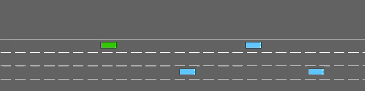
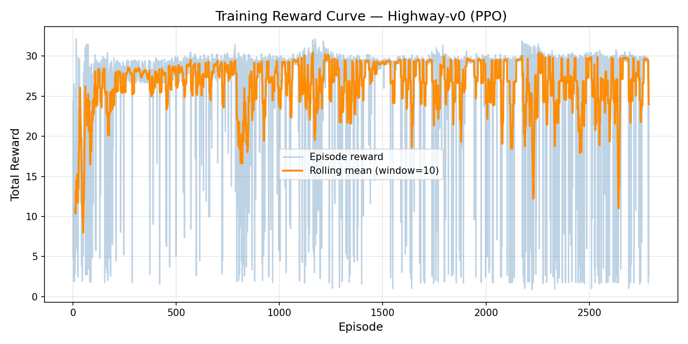

# 🚗 Autonomous Driving with Highway-Env

**Course:** CMP4501 – Applied Reinforcement Learning
**Project Track:** Option A – Autonomous Driving with Highway-Env
**Student:** _Amine ben ayed & Muhammad Ghilan Adabi Dihan_
**Algorithm:** Proximal Policy Optimization (PPO) – Stable-Baselines3

---

## 🎬 Evolution Video

The video below shows the agent at three stages of training: untrained (random behavior), half-trained (partial learning, occasional mistakes), and fully trained (smooth, safe driving).



> _Sequential montage of untrained → half-trained → fully-trained driving episodes._

---

## 📑 Table of Contents

1. [Overview](#-overview)
2. [Methodology](#-methodology)
   - [Reward Function](#a-reward-function)
   - [The Model](#b-the-model)
   - [States and Actions](#c-states-and-actions)
3. [Training Analysis](#-training-analysis)
4. [Challenges and Failures](#-challenges-and-failures)
5. [Project Structure](#-project-structure)
6. [How to Run](#-how-to-run)

---

## 📌 Overview

The goal of this project is to train an autonomous vehicle to drive **as fast and as safely as possible** in dense highway traffic without crashing.

This is fundamentally a **multi-objective optimization problem**: the agent must simultaneously balance three competing goals — maintaining high speed, staying in the correct lane, and avoiding collisions. The agent is trained using **Proximal Policy Optimization (PPO)**, an on-policy actor-critic algorithm, on the `highway-v0` environment from the [highway-env](https://github.com/Farama-Foundation/HighwayEnv) library.

---

## 🧠 Methodology

### a. Reward Function

The `highway-v0` environment uses a composite reward function that combines three weighted components evaluated at every timestep `t`:

$$
R_t = \alpha \cdot \frac{v_t - v_{\min}}{v_{\max} - v_{\min}} \;+\; \beta \cdot \frac{\ell_t}{\ell_{\max}} \;-\; \gamma \cdot \mathbb{1}_{\text{collision}}
$$

**Where:**

| Symbol                          | Meaning                                      | Value          |
| ------------------------------- | -------------------------------------------- | -------------- |
| $v_t$                           | Current vehicle speed at time $t$            | —              |
| $v_{\min}, v_{\max}$            | Speed range used for normalization           | $[20, 30]$ m/s |
| $\ell_t$                        | Index of the current lane (rightmost = best) | —              |
| $\ell_{\max}$                   | Index of the rightmost lane                  | $3$            |
| $\mathbb{1}_{\text{collision}}$ | Indicator: 1 if a collision occurs, else 0   | $\{0,1\}$      |
| $\alpha$                        | Weight for the **high-speed** term           | $0.4$          |
| $\beta$                         | Weight for the **right-lane** term           | $0.1$          |
| $\gamma$                        | Penalty for **collision**                    | $1.0$          |

The total reward is finally clipped to the range $[0, 1]$.

**Justification.** This formulation directly encodes the three objectives of the problem:

- The **speed term** ($\alpha$) rewards forward progress, discouraging timidity.
- The **lane term** ($\beta$) encourages compliance with right-lane driving conventions.
- The **collision term** ($\gamma$) introduces a sharp, episode-ending penalty, making it the dominant signal — exactly what we want for a safety-critical task. The large weight on collisions ensures the agent learns to value survival above speed.

---

### b. The Model

We used **Proximal Policy Optimization (PPO)** from Stable-Baselines3.

**Why PPO?**

PPO was chosen over DQN for three reasons:

1. **Stability** — PPO's clipped surrogate objective prevents catastrophic policy updates, which is essential in this environment where a single bad action causes a crash.
2. **Continuous-friendly architecture** — Even though highway-v0 uses discrete meta-actions, PPO's actor-critic design generalizes naturally if the action space is later switched to continuous steering.
3. **Sample efficiency for the observation type** — The default observation is a small kinematic matrix (not pixels), so a simple MLP policy with PPO converges quickly on CPU.

**Hyperparameters:**

| Hyperparameter           | Value       | Rationale                                      |
| ------------------------ | ----------- | ---------------------------------------------- |
| Policy                   | `MlpPolicy` | Observation is numerical, not visual           |
| Learning rate            | `3e-4`      | SB3 default; stable for PPO                    |
| Discount factor $\gamma$ | `0.99`      | Standard long-horizon weighting                |
| `n_steps`                | `256`       | Steps per rollout per env                      |
| `batch_size`             | `64`        | Mini-batch size for SGD                        |
| `n_epochs`               | `10`        | Optimization passes per rollout                |
| Clip range $\epsilon$    | `0.2`       | PPO default                                    |
| Total timesteps          | `100,000`   | Sufficient for stable convergence on this task |

**Network Architecture.**

The default Stable-Baselines3 `MlpPolicy` uses **two fully connected hidden layers of 64 units each**, with **Tanh** activation functions. The network outputs separate heads for the **policy** (action probabilities over 5 discrete actions) and the **value function** (a scalar state-value estimate).

```
Input (kinematic obs: 5 × 5 matrix → flattened to 25)
    │
    ▼
Linear(25 → 64) → Tanh
    │
    ▼
Linear(64 → 64) → Tanh
    │
    ├── Policy head: Linear(64 → 5)     [action logits]
    └── Value  head: Linear(64 → 1)     [state value]
```

---

### c. States and Actions

**Observation space — `Kinematics`:**

The agent receives a `5 × 5` matrix describing the **ego vehicle and the four closest surrounding vehicles**:

| Column | Feature    | Description                                        |
| ------ | ---------- | -------------------------------------------------- |
| 0      | `presence` | 1 if the vehicle exists in the observation, else 0 |
| 1      | `x`        | Longitudinal position (relative to ego)            |
| 2      | `y`        | Lateral position (relative to ego)                 |
| 3      | `vx`       | Longitudinal velocity                              |
| 4      | `vy`       | Lateral velocity                                   |

This relative encoding gives the policy a translation-invariant view of the traffic scene.

**Action space — `DiscreteMetaAction`:**

The agent selects from **five high-level driving commands** at each step:

| ID  | Action       | Meaning                         |
| --- | ------------ | ------------------------------- |
| 0   | `LANE_LEFT`  | Change lane to the left         |
| 1   | `IDLE`       | Maintain current speed and lane |
| 2   | `LANE_RIGHT` | Change lane to the right        |
| 3   | `FASTER`     | Accelerate                      |
| 4   | `SLOWER`     | Decelerate                      |

Meta-actions abstract away low-level steering and throttle dynamics, making the learning problem tractable on a CPU.

---

## 📈 Training Analysis

### Reward Graph

Episode reward over 100,000 training timesteps:



### Commentary

The reward curve shows three distinct learning phases:

1. **Initial exploration (~episodes 0 – 50).** During the first few thousand
   timesteps the agent has random weights and quickly fails — rewards
   fluctuate wildly in the 5–15 range as the car crashes early in most
   episodes. This is visible as the steep dip near the start of the
   orange rolling-average curve.

2. **Rapid improvement (~episodes 50 – 200).** Once PPO accumulates enough
   gradient signal from the collision penalty, learning is remarkably
   fast: the rolling-average reward climbs sharply from ~10 to ~28 in
   roughly 150 episodes. This is the phase where the agent discovers
   the core survival behavior — slow down when blocked, change lanes
   when necessary, and stay in the right lane to harvest the lane
   reward.

3. **Long stable plateau (~episodes 200 – 2800).** After the initial
   breakthrough, the rolling mean stabilises around 25–30, close to
   the natural ceiling set by reward clipping. The agent has converged
   to a competent driving policy.

   The plot is **not perfectly flat** — there are periodic dips visible
   throughout, where the rolling mean briefly drops to ~15–20.
   These correspond to episodes where the agent encounters an unusually
   aggressive traffic configuration (e.g. several vehicles cutting in
   simultaneously) and crashes despite a sound policy. This is
   **expected behavior** in a stochastic environment and reflects
   the inherent difficulty of dense-traffic driving, not a failure of
   learning.

Overall, learning was **fast, stable, and monotonic** — there was no
policy collapse and no catastrophic forgetting, which we attribute to
PPO's clipped surrogate objective and the conservatively low learning
rate of `3e-4`. The fact that the agent reached peak performance in
under 10% of the total training budget suggests that the chosen
hyperparameters were well-suited to the task, and that we could likely
have stopped training much earlier without losing performance.

---

## 🛠️ Challenges and Failures

**Challenge: Python version incompatibility (early-project blocker).**

Initial setup failed because the development machine was running Python 3.14, which is too new for several critical dependencies. The error trail pointed to `ale-py` (a transitive dependency of `stable-baselines3[extra]`) requiring `Python < 3.13`, and `moviepy` lacking pre-built wheels for the newer interpreter. Pinned package versions in `requirements.txt` compounded the issue by excluding compatible newer releases.

**Resolution.** The Python toolchain was downgraded using **pyenv**:

```bash
pyenv install 3.11.9
pyenv local 3.11.9
```

The pinned versions in `requirements.txt` were also removed in favor of unpinned dependencies, letting `pip` resolve a compatible set automatically. After this, installation succeeded and training proceeded normally.

**Lesson learned.** When working with RL libraries that depend on a large stack (PyTorch, Gymnasium, Atari wrappers, video tooling), it is safer to use a _well-supported, mainstream_ Python version (3.10 or 3.11) rather than the cutting edge. Reproducibility of an ML project is bottlenecked by its weakest dependency.

---

## 📂 Project Structure

```
highway-rl-project/
├── README.md                       ← this file
├── requirements.txt
├── .gitignore
├── src/
│   ├── config.py                   ← all hyperparameters (separated from logic)
│   ├── model.py                    ← PPO model factory (build & load)
│   ├── utils.py                    ← env factory & reward plotter
│   ├── train.py                    ← training pipeline with 3 checkpoints
│   ├── evaluate.py                 ← loads checkpoints & records videos
│   └── make_evolution_gif.py       ← stitches videos into evolution.gif
├── assets/
│   ├── reward_plot.png             ← training reward curve
│   └── evolution.gif               ← stitched evolution video
└── videos/
    ├── 1_untrained-episode-0.mp4
    ├── 2_half_trained-episode-0.mp4
    └── 3_fully_trained-episode-0.mp4
```

---

## ▶️ How to Run

**1. Clone and install dependencies (Python 3.11 recommended):**

```bash
git clone <your-repo-url>
cd highway-rl-project
python -m venv venv
source venv/bin/activate          # macOS / Linux
pip install -r requirements.txt
```

**2. Train the agent (saves all 3 checkpoints + reward plot):**

```bash
python src/train.py
```

**3. Record the evolution videos for each stage:**

```bash
python src/evaluate.py
python src/make_evolution_gif.py     # creates assets/evolution.gif from the 3 videos
```

Output videos appear under `videos/`. The reward plot is saved to `assets/reward_plot.png`.

---

## 📚 References

- [Stable-Baselines3 Documentation](https://stable-baselines3.readthedocs.io/)
- [Gymnasium Documentation](https://gymnasium.farama.org/)
- [highway-env Documentation](https://highway-env.farama.org/)
- Schulman et al., _Proximal Policy Optimization Algorithms_, 2017.

---

_Submitted in fulfillment of CMP4501 – Applied Reinforcement Learning._
